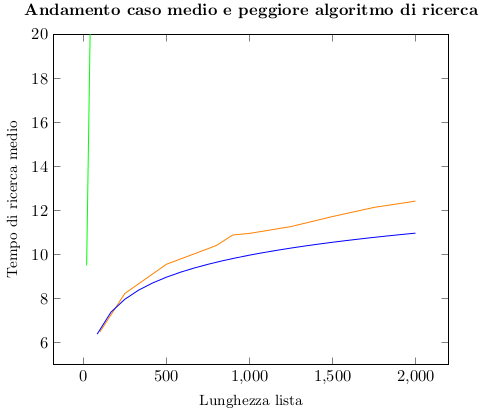

# Albero Rosso-Nero vs Alberi Binari di Ricerca
Andrea Aligi Assioma\
13 Gennaio 2022\
## 1. Introduzione
Nella seguente relazione si vuole analizzare le differenze tra Alberi Binari di Ricerca e Alberi Rosso-Neri, 
in particolare come variano i tempi medi di ricerca degli elementi inseriti, a seconda del tipo di lista.\
\
Gli Alberi Binari di Ricerca (ABR) e gli Alberi Rosso-Neri (ARN) sono strutture dati collegate caratterizzate da:
* __T.root__ un puntatore a alla radice dell’albero.
* __x.p__ un puntatore al padre del nodo x.
* __x.left__ un puntatore al successivo nodo sinistro (è quindi il figlio sinistro del nodo x).
* __x.key__ un attributo che aggiunge al nodo x un valore chiamato chiave.
<!---->
L’Albero Rosso-Nero, rispetto all’Albero Binario di Ricerca, possiede anche un
attributo chiamato colore (__x.color__) che può essere rosso o nero, e le sue foglie non contengono valore.\
\
Entrambi gli alberi supportano operazioni dinamiche, tra cui l’inserimento e
la ricerca.
L’algoritmo di ricerca ritorna il tempo che impiega per individuare un nodo
(generalmente O(lgn)), se esiste. Altrimenti, ritorna un valore vuoto NIL.\
L’algoritmo di inserimento, invece, aggiunge un nuovo nodo all’interno di un
albero dato in input, scorrendo tra quelli già inseiriti. Nel caso degli ARN gli
viene attribuito anche un colore, e perciò necessita di un’ulteriore funzione la
quale evita che vengano violate le 5 proprietà di questo tipo di albero.
### 1.1 Hardware e Sistema operativo utilizzati
Le piattaforme sui cui verrano effettuati gli esperimenti sono:
* Un pc fisso con processore i5-10600k e 16gb di ram. Il sistema operativo
adoperato è Ubuntu 20.04.
* Un portatile con processore M1 e 8 gb di ram. Il sistema operativo adop-
erato è OS Monterey.
<!---->
Non in tutti gli esperimenti sono stati usati entrambi.
## 2. Algoritmo di ricerca
In generale, è difficile stabilire un tempo medio per quanto riguarda le operazioni di ricerca degli elementi in un albero, in quanto quest’ultimo non è sempre uguale. E’ possibile comunque provare che la distanza media di un nodo a
partire dalla radice è O(lgn), ed è quindi assimilabile a un’analisi del metodo
di ricerca.\
L’inserimento degli elementi della lista verrà effettuato in modo ricorsivo. Tali
liste avranno dimensione 100, 250, 500, 800, 900, 100, 1250, 1500, 2000 e
si distinguono in ordinate in modo crescente e casuali (cioè liste ordinate, i
cui elementi sono stati ”mescolati” in modo casuale tramite apposita funzione
random.sample()).\
Per ciascuna lista sono state effettuate 50 prove, e, successivamente, si è calcolata la media.\
In python è stato imposto un limite di ricorsioni per evitare l’overflow dello
stack e per buona pratica di programmazione si evita di aumentare tale limite:
perciò gli elementi della lista sono stati inseriti in modo iterativo.\
Prima dell’analisi dei risultati, ci si può aspettare che nel caso dell’Albero Binario di Ricerca si avrà una distanza media di un nodo dalla radice più elevata,
specialmente nell’inserimento di liste ordinate (in quanto si sta praticamente
realizzando un albero con altezza massima n-1, dove n rappresenta la lunghezza
della lista inserita).\
Nel caso degli Alberi Rosso-Neri, invece, ci si può aspettare delle distanze medie
minori grazie all’implementazione del metodo insertFixup, il quale ”bilancia”
l’albero in modo tale che, nel momento in cui si cerca un nodo, non si scende
troppo in profondità.\
Per entrambi gli algoritmi sono state realizzate delle funzioni iterative di inserimento e in ARN è stata usata una funzione iterativa di ricerca degli elementi
per il calcolo della distanza di ogni nodo dalla radice.\
In ABR, invece, la distanza è stata calcolata direttamente all’interno del metodo
di inserimento in quanto è risulato più semplice e pratico
(nodeInsertion ha implementazione simile a quella del metodo di ricerca, e
quindi non presenta una chiamata alla funzione insertFixup, come nel caso
degli ARN).
### 2.1 Albero binario di ricerca
Per l'implementazione del seguente tipo di albero, sono state realizzate due
classi:
* __Node__: è una classe che possiede solo il costruttore e nessun altro metodo.
Permette di realizzare il nodo di un albero che ha come attributi un valore
chiamato chiave (key) e due puntatori ai figli.\
Ogni volta che viene istanziato un suo oggetto:
    * I figli _self.left_ e _self.right_ sono inizializzati a _None_ (vuoti).
    * L’attributo _key_, assume il valore dato in input.
* __BST__: è la classe che inizializza e sviluppa l’albero, e calcola la distanza di
un nodo dalla radice. I metodi utilizzati sono:
    * _setRoot_ inizializza il nodo radice, prendendo il primo nodo inserito
come input. Questo metodo è utile per puntare alla radice dell’ablero.
    * _insert_ permette l’inserimento di un nodo, sia questo il primo (e
quindi il nodo radice) o uno successivo. Come input prende solo il
valore (_key_) da assegnare al nodo.
    * _nodeInsertion_ permette l’inserimento di nodi successivi a quello
radice. Inoltre, calcola la distanza del nodo inserito a partire dalla
radice. Come input si ha il nodo di partenza e la chiave da inserire.
Come output, si ha la distanza espressa in numero di nodi ”attraversati” durante l’inserimento.
<!---->
L’esito degli esperimenti è stato il seguente (con valori espressi a tre cifre
significative):
\
Il tempo di inserimento di una lista è espresso in numero di nodi.\
A livello grafico si ha invece:\
\
La funzione di inserimento di una lista casuale impiega generalmente meno
tempo rispetto all’inserimento in ordine crescente.
### 2.2 Albero rosso-nero
Ha implementazione simile all’albero binario di ricerca, con la differenza che vengono aggiunti due nuovi attributi (color e un puntatore al padre p ) e due nuovi
metodi (uno che impedisce la violazione delle 5 proprietà dell’albero, l’altro, invece, ricerca un nodo a partire dalla radice per determinarne la distanza). Si
hanno comunque due classi:
* __Node__: simile alla classe dell’albero precedente, possiede un ulteriore l’attributo
color e un puntatore al padre, dati in input dall’utente. Nel momento
in cui viene istanziato un oggetto, il valore color può essere ”Red” o
”Black”.
* __RBT__: inizializza l’albero e inserisce nodi. insert e nodeInsertion sono
praticamente invariati. Solo nodeInsertion presenta una chiamata aggiuntiva a una nuova funzione posta successivamente all’inserimento del
nuovo nodo, e cioè insertFixup.\
Presenta tre ulteriori metodi:
    * _insertFixup_ modifica la struttura dell’albero, attraverso rotazioni o
il cambiamento di colore dei nodi, affinché non si violano proprietà
dell’albero. Come input prende il nuovo nodo inserito.
    * _leftRotate_ e _rightRotate_ sono metodi che ruotano, rispettiva-
mente, a sinistra e a destra un nodo dato in input.
    * _searchNode_ cerca il nodo dato in input a partire dalla radice, e ri-
torna in output la distanza da quest’ultima.
<!---->
Gli esiti degli esperimenti sono stati effettuati con le stesse notazioni dell’albero
precedente:
\
A livello grafico si ha invece:\
\
Dalla tabella si può notare l’efficacia di insertFixup, il quale riduce di molto
le distanze dei nodi dalla radice.
### 2.3 Conclusioni
In entrambi gli alberi si può notare come il tempo medio di ricerca ha un andatura logaritmica, e quindi si ”stabilizza” a partire dalle liste di lunghezza
maggiore o uguale a 900.\
Rispetto a quanto intuito preventivamente, nel caso del calcolo della profondità
media di una lista casuale nell’Albero Binario di Ricerca non si ha esattamente
O(lgn), ma si è molto vicini a tale stima: ciò può essere dovuto a una serie di
casi sfortunati in cui la profondità è risultata molto più elevata e hanno fatto
media con dei casi migliori.\
Per il resto, non ci si è discostati molto dalle ipotesi iniziali: infatti, viene
marcata la differenza dei tempi di ricerca nell’inserimento di una lista ordinata
nell’Albero Binario di Ricerca rispetto ai restanti casi.